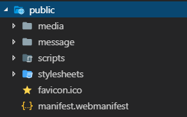

# steffens-kode-base
[changelog](./CHANGELOG.md)
## Structure
Server.js i roden, styrer hele projektet. Her er der stier der bliver **required**.
```javascript
require('./config/index')(app);
require('./routes/index')(app);
```
I **config**-mappen ligger der JS-filer til forskellige overordnet funktioner/NPM-packages, som bliver autogenereret via filen index.js. Derfor kan der nemt tilføjes flere, eller fjerne de eksisterende, hvis disse ikke skal bruges.

I **routes**-mappen kan der tilføjes flere routes til projektet(Som også bliver autogenereret via index-filen). Til disse routes kan man nemt referere til views uden mappestruktur, da det hele bliver kørt i server.js

Mappen **public** er til dine statiske filer hvor media, scripts og stylesheets hører til.

## NPM Packages
* **Depended Packages**
* [body-parser](https://www.npmjs.com/package/body-parser)
* [dotenv](https://www.npmjs.com/package/dotenv)
* [ejs](https://www.npmjs.com/package/ejs)
* [express](https://www.npmjs.com/package/express)
* [express-formidable](https://www.npmjs.com/package/express-formidable)
* [express-session](https://www.npmjs.com/package/express-session)
* [morgan](https://www.npmjs.com/package/morgan)
* [mysql](https://www.npmjs.com/package/mysql)
* **Developer packages**
* [debug](https://www.npmjs.com/package/debug)
* [nodemon](https://www.npmjs.com/package/nodemon)
* [run-script-os](https://www.npmjs.com/package/run-script-os)

## Project description
Steffens-kode-base er en skabelon til en applikation, baseret på ExpressJS. Her får du en brugervenlig tilgang til opbygningen, som samtidig er nem at rette til.

Tilføj og fjern nemt funktioner til dit projekt uden at det påvirker resten af opsætningen.
## Commands

* Installer projektet med: `npm install`
* Kør developer-versionen: `npm run dev`
* Kør projektet: `npm start`

## Code examples
Eksporter nemt et route, via en fil i mappen routes:
```Javascript
module.exports = function (app) {

    app.get('/', (req, res) => {
        res.render('main', { 'title': 'Kodebasen byder dig velkommen!', 'content': 'Her er der indhold' });
    });
};
```
Opret nemt et view, via en fil i mappen views, "include" ønskede dele til dit view:
```html
<% include partials/head.ejs %>
<% include partials/header.ejs %>
<main tabindex="0" role="main" class="main" id="maincontent">
    <h1><%= title %></h1>
    <p><%= content %></p>
</main>
<% include partials/footer.ejs %>
<% include partials/after-footer.ejs %>
```
Tilføj nemt filer til projektet via mappen public <br>

```html

```